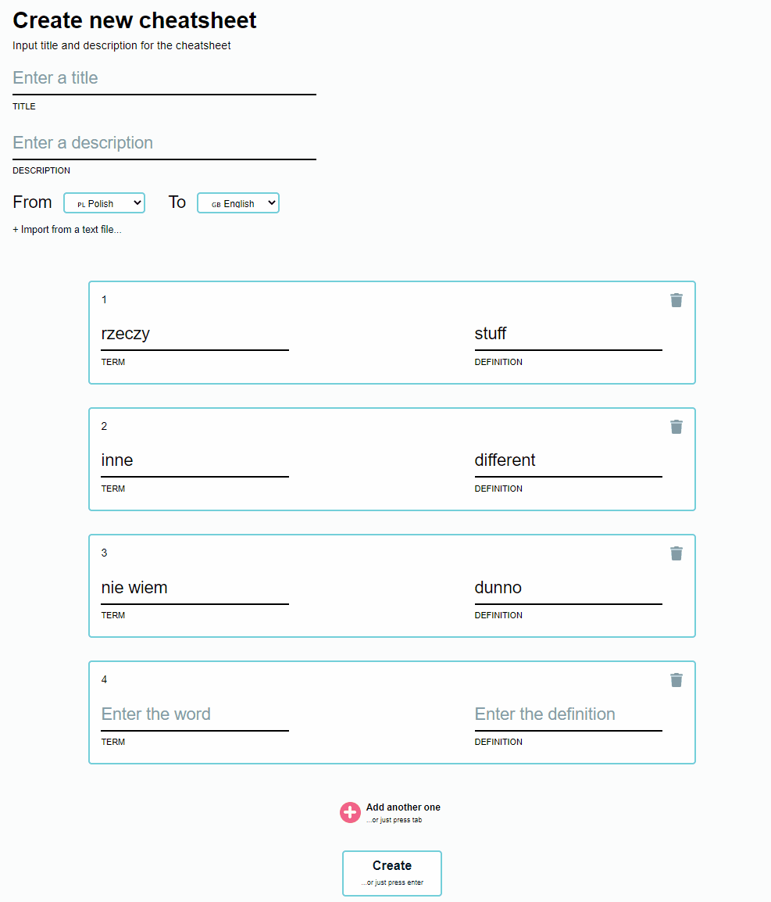

# Cheats

This app is where my programming passion actually started. Not during this particular project, but with many iterations of the idea, such as this one.
I focused on building it with User Experience and Accessibility in mind. Website is navigable with keys, and important operations are also done through the keyboard, such as deleting the card.

It might be politically incorect, but I still think its a cool project for giving people ability to take pairs of words and turn them into a 'perfectly' formatted cheatsheet.

The app currently is abandoned in favour of much more sophisticated version, that includes database, typescript, tests and all round more professional approach. It will serve as a source of inspiration and well built components.

The app is working locally, but the deployed website crashes due to session not working the same as locally for reason unknown to me.

Here is the semi-working version of the app, deployed to Zeit: https://cheats.now.sh/created

And here is a video of the app converting user input on the website to cheatsheet in Word.

## Technologies used

- Next.js as a server-side rendering framework and API (which I did not figure out for deployment)
